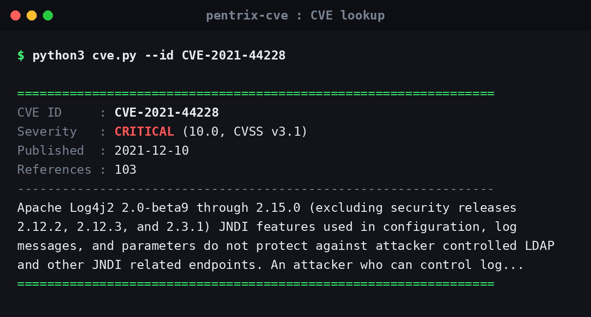
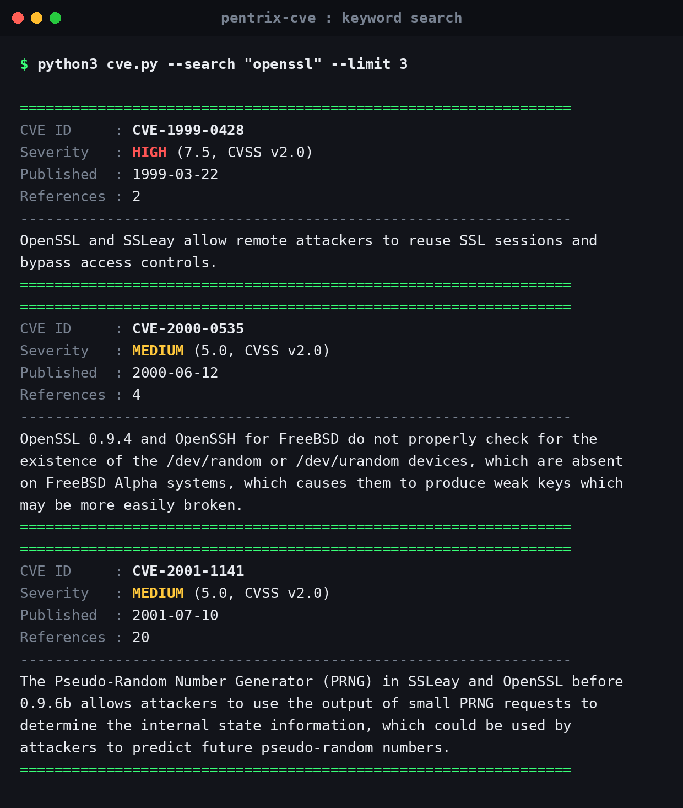
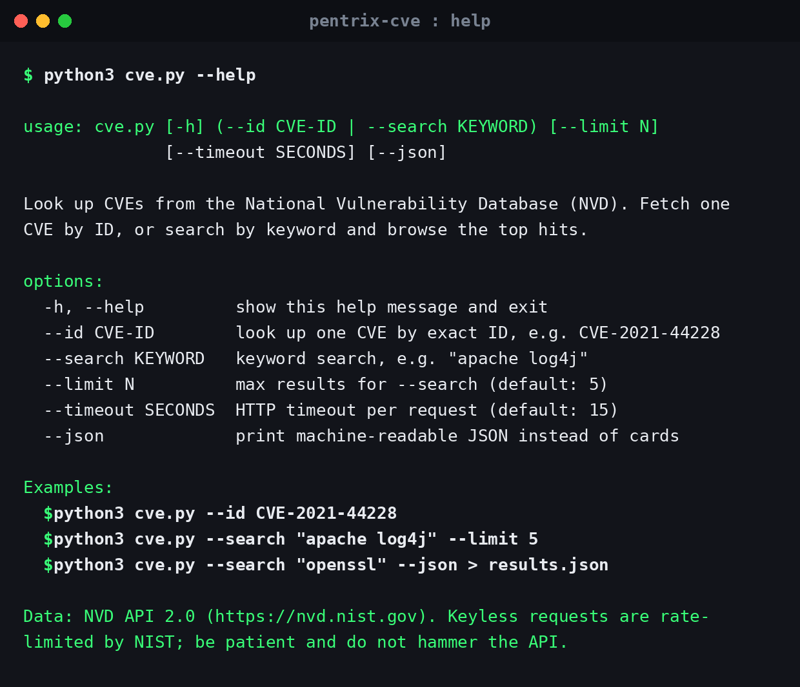

# pentrix-cve


A tiny CVE lookup CLI powered by the NVD API 2.0. Zero dependencies, just the Python standard library.

## Table of Contents

- [Features](#features)
- [Screenshots](#screenshots)
- [Install](#install)
- [Usage](#usage)
  - [Look up one CVE by ID](#look-up-one-cve-by-id)
  - [Keyword search](#keyword-search)
  - [JSON output](#json-output-for-piping-into-jq-or-your-own-tooling)
  - [Options](#options)
- [Rate limits and data source](#rate-limits-and-data-source)
- [Ethical use](#ethical-use)
- [License](#license)

## Features

- Look up any CVE by exact ID (e.g. `CVE-2021-44228`)
- Keyword search across the NVD with a configurable result limit
- Shows CVSS v3.x base score and severity, falling back to v2 when v3 is missing
- Clean human-readable cards, or machine-readable `--json` output
- Polite API behavior: 6-second delay between paged requests, clear messages on HTTP 403/429
- No pip packages, no virtualenv, works anywhere Python 3.6+ exists

## Screenshots

**CVE detail view** (`--id CVE-2021-44228`):



**Keyword search** (`--search "openssl" --limit 3`):



**Help output** (`--help`):



## Install

```bash
git clone https://github.com/mizazhaider-ceh/pentrix-cve.git
cd pentrix-cve
python3 cve.py --help
```

Requirements: Python 3.6+. No pip packages, no virtualenv, nothing.

## Usage

### Look up one CVE by ID

```bash
python3 cve.py --id CVE-2021-44228
```

```
================================================================
CVE ID     : CVE-2021-44228
Severity   : CRITICAL (10.0, CVSS v3.1)
Published  : 2021-12-10
References : 103
----------------------------------------------------------------
Apache Log4j2 2.0-beta9 through 2.15.0 (excluding security releases 2.12.2, 2.12.3, and 2.3.1) JNDI features used in configuration, log messages, and parameters do not protect against attacker controlled LDAP and other JNDI related endpoints. An attacker who can control log...
================================================================
```

Real output from the live NVD API.

### Keyword search

```bash
python3 cve.py --search "openssl" --limit 3
```

```
================================================================
CVE ID     : CVE-1999-0428
Severity   : HIGH (7.5, CVSS v2.0)
Published  : 1999-03-22
References : 2
----------------------------------------------------------------
OpenSSL and SSLeay allow remote attackers to reuse SSL sessions and bypass access controls.
================================================================
================================================================
CVE ID     : CVE-2000-0535
Severity   : MEDIUM (5.0, CVSS v2.0)
Published  : 2000-06-12
References : 4
----------------------------------------------------------------
OpenSSL 0.9.4 and OpenSSH for FreeBSD do not properly check for the existence of the /dev/random or /dev/urandom devices, which are absent on FreeBSD Alpha systems, which causes them to produce weak keys which may be more easily broken.
================================================================
================================================================
CVE ID     : CVE-2001-1141
Severity   : MEDIUM (5.0, CVSS v2.0)
Published  : 2001-07-10
References : 20
----------------------------------------------------------------
The Pseudo-Random Number Generator (PRNG) in SSLeay and OpenSSL before 0.9.6b allows attackers to use the output of small PRNG requests to determine the internal state information, which could be used by attackers to predict future pseudo-random numbers.
================================================================
```

Real output from the live NVD API.

### JSON output (for piping into jq or your own tooling)

```bash
python3 cve.py --id CVE-2021-44228 --json
```

```json
{
  "id": "CVE-2021-44228",
  "cvss_version": "3.1",
  "cvss_score": 10.0,
  "severity": "CRITICAL",
  "published": "2021-12-10",
  "description": "Apache Log4j2 2.0-beta9 through 2.15.0 (excluding security releases 2.12.2, 2.12.3, and 2.3.1) JNDI features used in configuration, log messages, and parameters do not protect against attacker controlled LDAP and other JNDI related endpoints. An attacker who can control log...",
  "references": 103
}
```

### Options

| Flag | Description |
|---|---|
| `--id CVE-ID` | Look up one CVE by exact ID |
| `--search KEYWORD` | Keyword search |
| `--limit N` | Max search results (default: 5) |
| `--timeout SECONDS` | HTTP timeout per request (default: 15) |
| `--json` | Print JSON instead of cards |

Exit codes: `0` on success, `1` on lookup/network/API errors, `2` on bad CLI usage.

## Rate limits and data source

All data comes from the [NVD API 2.0](https://nvd.nist.gov/developers), maintained by NIST. Keyless requests are rate-limited by NIST (a few per 30 seconds), so:

- `pentrix-cve` waits 6 seconds between paged requests automatically.
- If you hit HTTP 403/429, wait a few minutes and retry. For heavy use, request a free API key at https://nvd.nist.gov/developers/request-an-api-key.

## Ethical use

This tool queries public vulnerability data for research, learning, and defensive security work: patch prioritization, lab notes, threat modeling, and security tooling. Do not use it to target systems you are not authorized to test. Only run exploit-related follow-up work against systems you own or have explicit written permission to assess, and always respect the rules of any bug bounty program or engagement scope.

## License

MIT, see [LICENSE](LICENSE).
